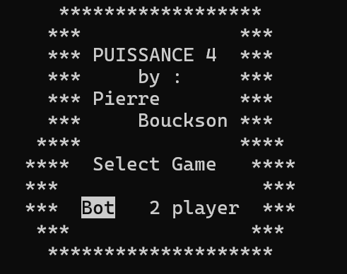
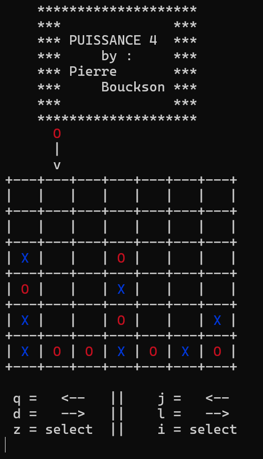

# Jeux Puissance 4 en C++

<p align="center">
  
</p>

## Compiler

Le Makefile utilise par defaut gcc, il peut etre changer selon la plateforme

``` bash
make all
./build/puissance4
```

## Jouer

Selectionner un mode de jeux `Bot` ou `2 player`

Joueur 1 :
-   `q` : se déplacer vers la gauche\
-   `d` : se déplacer vers la droite\
-   `z` : valider le choix

Joueur 2 :
-   `j` : se déplacer vers la gauche\
-   `l` : se déplacer vers la droite\
-   `i` : valider le choix


<p align="center">
  
</p>

Quand il y a un gagnant, utilisez **CTRL+C** pour quitter puis relancez
`./build/puissance4`.